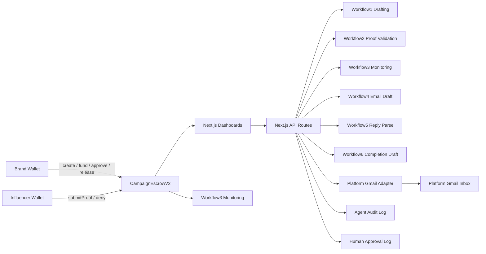

<p align="center">
  
</p>

<h1 align="center">Clawgency</h1>
<p align="center"><strong>AI-assisted, milestone-escrow influencer operations on BNB Chain</strong></p>

Clawgency is a professional influencer-operations platform that combines:
- on-chain escrow execution (BNB Chain)
- role-based product workflows (Brand / Influencer / Admin)
- deterministic OpenClaw agent recommendations
- human-approved email automation with signed audit logs

Human-in-the-loop is mandatory for sensitive actions:
- AI outputs are advisory
- wallet transactions require manual signature
- email sends require explicit approval metadata and audit records

## Table of Contents
1. [Live Deployments](#live-deployments)
2. [Core Capabilities](#core-capabilities)
3. [Repository Layout](#repository-layout)
4. [Architecture](#architecture)
5. [Smart Contract Structure and Design](#smart-contract-structure-and-design)
6. [Frontend Product Surface](#frontend-product-surface)
7. [API Reference](#api-reference)
8. [OpenClaw Workflows](#openclaw-workflows)
9. [Configuration](#configuration)
10. [Local Setup](#local-setup)
11. [Deployment and Mainnet Migration](#deployment-and-mainnet-migration)
12. [Vercel Production Setup](#vercel-production-setup)
13. [Testing](#testing)
14. [Security Model](#security-model)
15. [Observability and Logs](#observability-and-logs)
16. [Known Limitations](#known-limitations)
17. [Additional Docs](#additional-docs)

## Live Deployments
- Web app: `https://clawgency.vercel.app`
- BSC Mainnet contract (verified):
  - `0x3C79563E4AA6566240790B404D18d3f7F093Fa12`
  - `https://bscscan.com/address/0x3C79563E4AA6566240790B404D18d3f7F093Fa12#code`

## Core Capabilities
- Milestone-based campaign escrow with agency fee split
- Offer negotiation workflow (brand offer, creator counter, accept/decline)
- Proof submission and brand approval lifecycle
- Role-specific dashboards:
  - `/brand/dashboard`
  - `/influencer/dashboard`
  - `/admin/analytics`
- OpenClaw workflows:
  - campaign drafting
  - proof validation
  - on-chain monitoring
  - outreach/reply email intelligence
- Backend-only Gmail integration (mock/live modes)
- HMAC-chained human approval log signatures for email sends

## Repository Layout
```txt
clawgency/
|- contracts/
|  `- CampaignEscrowV2.sol
|- scripts/
|  |- deploy-v2.ts
|  `- verify-v2.ts
|- test/
|  `- CampaignEscrowV2.ts
|- openclaw/
|  |- workflows/
|  |- schemas/
|  |- tests/
|  |- templates/
|  `- config/
|- frontend/
|  |- app/
|  |  |- brand/dashboard/
|  |  |- influencer/dashboard/
|  |  |- admin/analytics/
|  |  `- api/
|  |- components/
|  |- context/
|  |- lib/
|  `- tests/
|- docs/
`- .github/workflows/ci.yml
```

## Architecture


Data flow summary:
- On-chain value and state transitions happen only in `CampaignEscrowV2`.
- Frontend reads contract state via `wagmi`/`viem`.
- AI workflows produce deterministic advisory output.
- Backend enforces email send policy and approval logging.

## Smart Contract Structure and Design
Contract file: `contracts/CampaignEscrowV2.sol`

### Objectives
- Trust-minimized escrow between brands and creators
- Milestone-gated release flow
- Transparent agency fee extraction
- Safety controls for pause, reentrancy, and authorization

### Core Types
- `CampaignState`: `Created`, `Funded`, `Completed`, `Cancelled`
- `Campaign` struct fields:
  - `brand`, `influencer`
  - `totalMilestoneAmount`, `totalEscrowed`, `totalReleased`
  - `agencyFeeBps`, `reputationScore`, `state`
  - arrays for milestone amounts, approvals, paid flags, proof hashes

### Key Storage
- `campaignCount`
- `mapping(uint256 => Campaign) _campaigns`
- `mapping(address => uint256) influencerReputation`

### Function Matrix
- `createCampaign(...)`
  - validates addresses, milestones, and fee cap
  - initializes campaign and milestones
- `depositFunds(campaignId)` payable
  - brand-only
  - updates escrow and transitions to `Funded` if fully covered
- `submitProof(campaignId, proofHash)`
  - influencer-only
  - writes proof for next unpaid milestone
- `approveMilestone(campaignId, milestoneIndex)`
  - brand-only
  - requires proof present
- `releaseFunds(campaignId)`
  - brand-only + nonReentrant
  - releases all approved unpaid milestones
  - splits payout: influencer + agency owner
- `cancelCampaign(campaignId)`
  - brand or influencer
  - only before any payout release
  - refunds escrow to brand
- `getCampaign`, `getMilestone`
  - read helpers for dashboards
- `pause`, `unpause`
  - owner-only emergency controls

### Financial Rules
- `BASIS_POINTS = 10000`
- `MAX_AGENCY_FEE_BPS = 3000` (30%)
- agency payout = `gross * agencyFeeBps / BASIS_POINTS`
- influencer payout = `gross - agency payout`

### Security Controls
- `Ownable`
- `Pausable`
- `ReentrancyGuard`
- strict role checks (`brand` vs `influencer`)
- custom errors for deterministic revert handling

### Lifecycle Invariants
- cannot release without approved milestones
- cannot approve milestone without proof
- cannot cancel after payouts start
- campaign transitions are monotonic and bounded

## Frontend Product Surface
- `/login`: wallet connect + role routing
- `/register`: signed challenge profile registration
- `/creators`: global creator directory with wallet copy action
- `/brand/dashboard`:
  - AI draft generation
  - negotiation + on-chain creation
  - funding, milestone approval, release
- `/influencer/dashboard`:
  - offer counter/decline
  - proof submission + completion email trigger
- `/admin/analytics`:
  - monitoring scan
  - audit logs
  - human approval email send panel

Core frontend infra:
- Next.js 14 app router
- RainbowKit + wagmi + viem
- HeroUI + Tailwind CSS

## API Reference
### Agent APIs
- `POST /api/agent/workflow1`
- `POST /api/agent/workflow2`
- `GET /api/agent/workflow3`
- `POST /api/agent/workflow3`
- `GET /api/agent-logs`

### Profile APIs
- `POST /api/profiles/challenge`
- `POST /api/profiles/register`
- `GET /api/profiles`
- `GET /api/profiles/creators`

### Offer APIs
- `GET /api/offers`
- `POST /api/offers`
- `POST /api/offers/[offerId]/counter`
- `POST /api/offers/[offerId]/accept`
- `POST /api/offers/[offerId]/decline`

### Email APIs
- `POST /api/email/draft`
- `POST /api/email/send`
- `GET /api/email/replies`
- `POST /api/email/replies`
- `GET /api/email/approval-logs`
- `GET /api/email/oauth/start`
- `GET /api/email/oauth/callback`
- `POST /api/campaigns/proposal-email`
- `POST /api/campaigns/completion-email`

## OpenClaw Workflows
| Workflow | File | Purpose |
|---|---|---|
| Workflow 1 | `openclaw/workflows/workflow1-intelligent-drafting.js` | Draft campaign transaction proposal |
| Workflow 2 | `openclaw/workflows/workflow2-proof-validation.js` | Validate proof syntax and suggest approve/reject |
| Workflow 3 | `openclaw/workflows/workflow3-monitoring.js` | Scan chain events and produce alerts |
| Workflow 4 | `openclaw/workflows/workflow4-email-drafting.js` | Draft outreach email (advisory) |
| Workflow 5 | `openclaw/workflows/workflow5-reply-parsing.js` | Parse reply intent (yes/no/maybe) |
| Workflow 6 | `openclaw/workflows/workflow6-completion-email-drafting.js` | Draft completion notification email |

Safety posture:
- no private key access in workflow runtime
- no auto-send / no auto-execute on-chain
- advisory-only outputs with human review requirement

## Configuration
### Root `.env` (contract + shared backend)
```env
PRIVATE_KEY=0x...
BSC_TESTNET_RPC_URL=https://data-seed-prebsc-1-s1.bnbchain.org:8545
BSC_MAINNET_RPC_URL=https://bsc-dataseed.binance.org
ETHERSCAN_API_KEY=...
AGENCY_TREASURY=0x...
CONTRACT_ADDRESS_TESTNET=
CONTRACT_ADDRESS_MAINNET=
```

### Frontend `frontend/.env.local`
```env
NEXT_PUBLIC_WALLETCONNECT_PROJECT_ID=...
NEXT_PUBLIC_USE_TESTNET=true
NEXT_PUBLIC_BSC_TESTNET_RPC_URL=https://data-seed-prebsc-1-s1.bnbchain.org:8545
NEXT_PUBLIC_BSC_MAINNET_RPC_URL=https://bsc-dataseed.binance.org
NEXT_PUBLIC_CAMPAIGN_ESCROW_V2_ADDRESS=0x...
CONTRACT_ADDRESS_TESTNET=0x...
CONTRACT_ADDRESS_MAINNET=0x...
NEXT_PUBLIC_ADMIN_WALLET=0x...
OPENCLAW_ROOT=../openclaw
```

### Email / Approval / Profiles envs (frontend runtime)
```env
EMAIL_PROVIDER_MODE=mock
CLAWGENCY_PLATFORM_EMAIL=agency@clawgency.xyz
GOOGLE_OAUTH_CLIENT_ID=
GOOGLE_OAUTH_CLIENT_SECRET=
GMAIL_REFRESH_TOKEN=
GMAIL_OAUTH_REDIRECT_URI=http://localhost:3000/api/email/oauth/callback
GMAIL_REPLY_LABEL=clawgency-replies
HUMAN_APPROVAL_LOG_SIGNING_KEY=replace-with-long-random-secret
SYSTEM_EMAIL_APPROVER_ID=system_openclaw_automation

SUPABASE_URL=
SUPABASE_SERVICE_ROLE_KEY=
SUPABASE_ANON_KEY=
NEXT_PUBLIC_SUPABASE_URL=
NEXT_PUBLIC_SUPABASE_ANON_KEY=
SUPABASE_PROFILE_TABLE=wallet_profiles
PROFILE_AUTH_SECRET=replace-with-long-random-secret
```

## Local Setup
### Prerequisites
- Node.js 20+
- npm 10+

### 1) Install dependencies
```bash
npm install
cd frontend && npm install && cd ..
```

### 2) Contract build + tests
```bash
npm run build:contracts
npm run test:contracts
```

### 3) Agent tests
```bash
npm run test:agent
```

### 4) Run frontend
```bash
cd frontend
npm run dev
```

## Deployment and Mainnet Migration
### Deploy contract
```bash
npm run deploy:testnet
npm run deploy:mainnet
```

### Verify contract
```bash
npm run verify:testnet
npm run verify:mainnet
```

### Mainnet migration checklist
1. Set `PRIVATE_KEY`, `BSC_MAINNET_RPC_URL`, `AGENCY_TREASURY` in root `.env`.
2. Run `npm run deploy:mainnet`.
3. Copy deployed address to:
   - `.env` -> `CONTRACT_ADDRESS_MAINNET`
   - `frontend/.env.local` -> `NEXT_PUBLIC_CAMPAIGN_ESCROW_V2_ADDRESS`
   - `frontend/.env.local` -> `CONTRACT_ADDRESS_MAINNET`
4. Set `NEXT_PUBLIC_USE_TESTNET=false`.
5. Run `npm run verify:mainnet`.
6. Redeploy frontend with matching Vercel env values.

## Vercel Production Setup
Vercel project settings:
- Root Directory: `frontend`
- Install Command: `npm ci`
- Build Command: `npm run build`

Production env recommendations:
- use `EMAIL_PROVIDER_MODE=mock` for safe demo
- for live Gmail:
  - set `EMAIL_PROVIDER_MODE=live`
  - set `GOOGLE_OAUTH_CLIENT_ID`, `GOOGLE_OAUTH_CLIENT_SECRET`, `GMAIL_REFRESH_TOKEN`
  - set `GMAIL_OAUTH_REDIRECT_URI=https://<your-domain>/api/email/oauth/callback`
- set `HUMAN_APPROVAL_LOG_SIGNING_KEY` (required in production)

Important serverless note:
- `GMAIL_REFRESH_TOKEN_FILE` is not durable on serverless; prefer `GMAIL_REFRESH_TOKEN` env var.

## Testing
Root:
```bash
npm run test:contracts
npm run test:agent
```

Frontend:
```bash
cd frontend
npm run lint:ci
npm run typecheck
npm run build
npm run test:e2e
```

CI pipeline:
- `.github/workflows/ci.yml`

## Security Model
- Private keys never exposed to OpenClaw workflows.
- AI recommendations are advisory and non-executing.
- On-chain actions require explicit wallet signature.
- Email sends require explicit approval fields and signed audit entry.
- Rate limiting guards sensitive API routes.
- Backend-only email sending path (no direct agent send).

## Observability and Logs
- Agent audit log (frontend runtime):
  - default `os.tmpdir()/clawgency/agent-audit.log`
  - override via `CLAWGENCY_AGENT_AUDIT_LOG_FILE`
- Human approval log:
  - default `os.tmpdir()/clawgency/human-approval.log`
  - override via `CLAWGENCY_HUMAN_APPROVAL_LOG_FILE`
- OpenClaw local logs:
  - `openclaw/logs/*`

## Known Limitations
- No proxy upgrade pattern for current contract deployment.
- Offer storage uses local file on serverless by default; migrate to durable DB for multi-instance production.
- In-memory rate limiter is instance-local; use Redis/KV for global limits.
- Monitoring is polling-based, not event-stream daemon.
- Email is single platform mailbox (no multi-tenant inbox partitioning yet).

## Additional Docs
- `docs/ARCHITECTURE.md`
- `docs/CONTRACT_EXPLAINED.md`
- `docs/SECURITY_SANDBOXING.md`
- `docs/EMAIL_INTEGRATION.md`
- `docs/TESTING.md`
- `docs/DEMO.md`
