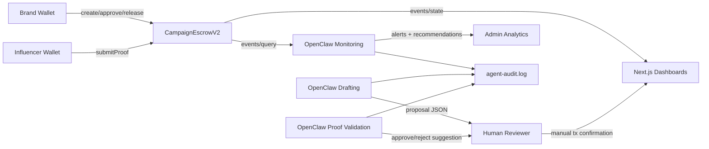

# Architecture

## System Overview

Clawgency Slot 2 is organized into four cooperating layers:

1. Smart contract layer (`CampaignEscrowV2`) on BNB Chain.
2. Frontend layer (Next.js + wagmi/RainbowKit).
3. OpenClaw agent orchestration layer (local scripts).
4. Logging/audit layer for agent and operator actions.

## Diagram

## Key Data Flows

- `Brand -> Contract`: campaign creation, deposit, milestone approvals, release.
- `Influencer -> Contract`: proof submissions.
- `Contract -> Frontend`: campaign/milestone reads, event-driven refresh.
- `OpenClaw -> Human`: structured suggestions only, never direct transaction execution.
- `OpenClaw -> Logs`: JSON line audit records with timestamps and event hash references.

## Human-in-the-Loop Guarantees

- Brand must manually approve milestones on-chain.
- Release calls are manual wallet actions through UI confirmations.
- OpenClaw scripts produce suggestions only (`autoExecute=false` in proposals).
